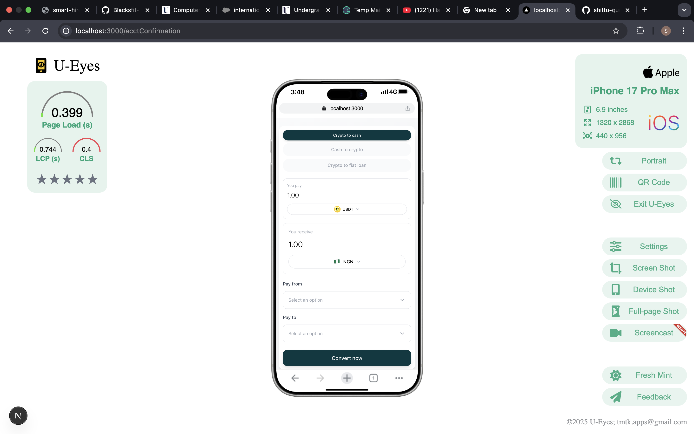
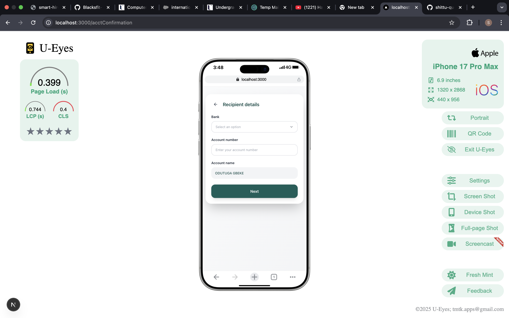

# Crypto Checkout Frontend Assessment

## Overview

This project is a frontend implementation of a **crypto checkout flow**, similar in concept to Stripe Checkout, built as part of a take-home assessment. The goal is to demonstrate the ability to translate Figma designs into clean, responsive, and production-ready frontend code using **React / Next.js**.

The implementation focuses on UI accuracy, component organization, form state management, responsiveness, and code quality. Backend integration was intentionally excluded and mock data is used where applicable.

---

## Project Scope

* Two screens were selected from the provided Figma design and implemented.
* The selected screens best demonstrate layout composition, form handling, and interaction flow.
* Emphasis was placed on frontend best practices rather than backend complexity.

---

## Tech Stack

* **Next.js**
* **React**
* **TypeScript**
* **Tailwind CSS**
* **Formik** – form state management
* **Yup** – schema-based form validation

---

## Features

* Responsive design (mobile and desktop)
* Page-based routing using Next.js
* Clean and maintainable code structure
* Controlled forms with validation
* Logical button and UI interactions
* Accessible form inputs and semantic HTML

---

## Screenshots

Below are screenshots of the implemented screens based on the provided Figma design.

```
/public/
  ├─ checkout.png
  └─ confirmation.png
```

Example usage in markdown:

## Screenshots

<p align="center">
  
  
</p>


---

## Live Demo

The project is deployed and accessible at:

**Live URL:**
[https://novacrust-self.vercel.app/](https://novacrust-self.vercel.app/)

---

## Form Handling and Validation

All form logic in this project is handled using **Formik**.
Validation rules are defined using **Yup**, ensuring:

* Required fields are enforced
* Input values follow expected formats
* Validation errors are displayed clearly and consistently

This approach keeps form logic declarative, predictable, and scalable.

---

## File Structure

The project follows the structure below, exactly as implemented:

```
novacrust/
├─ src/
│  ├─ pages/
│  │  ├─ api/
│  │  │  └─ hello.ts
│  │  ├─ _app.tsx
│  │  ├─ _document.tsx
│  │  ├─ acctConfirmation.tsx
│  │  └─ index.tsx
│  ├─ styles/
│  │  └─ globals.css
├─ public/
├─ next.config.ts
├─ next-env.d.ts
├─ tsconfig.json
├─ tailwind.config.js
├─ postcss.config.js
├─ eslint.config.mjs
├─ package.json
└─ README.md
```

The **Pages Router** approach was used to align with the existing Next.js setup.

---

## Getting Started

1. Install dependencies:

   ```bash
   npm install
   ```

2. Start the development server:

   ```bash
   npm run dev
   ```

3. Open in the browser:

   ```
   http://localhost:3000
   ```

---

## Notes

* This is a frontend-only implementation.
* No real payment processing or API integration is included.
* The focus is on UI, responsiveness, form handling, and code clarity.

---

## Author

Shittu Qudus Adekunle
Frontend Developer (React / Next.js)

---

## License

This project was created solely for evaluation and assessment purposes.
# Novacrust
